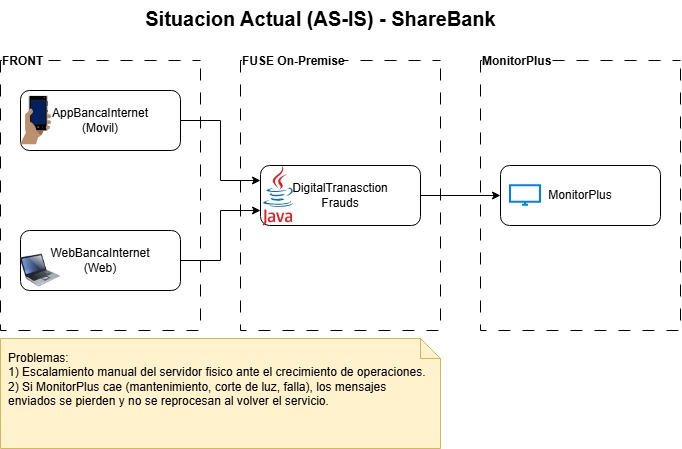
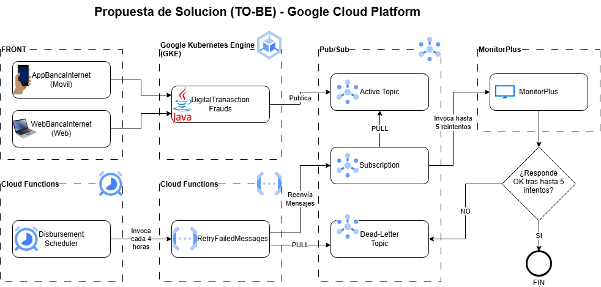

# Proyecto Final – Migración de DigitalTransactionFrauds a Google Cloud Platform

**Institución financiera (nombre ficticio):** ShareBank
**Proceso analizado:** Envío de eventos de transacciones financieras hacia la plataforma de prevención de fraude MonitorPlus

---

## 1. Contexto y situación actual (AS-IS)

ShareBank cuenta con dos canales digitales, la aplicación móvil **AppBancaInternet** y el portal web **WebBancaInternet**, a través de los cuales los clientes realizan operaciones financieras como pago de créditos, transferencias de dinero y desembolsos de crédito.

Cada una de estas operaciones es enviada a un servidor **On-Premise** (físico) de tipo FUSE, donde está desplegada una aplicación Java llamada **DigitalTransactionFrauds**. Esta aplicación expone tres servicios, cada uno asociado a un tipo de transacción y a un código de evento propio:

| Servicio | Tipo de transacción | Código de evento |
|---|---|---|
| `/CreditPaymentService` | Pago de créditos | 347 |
| `/MoneyTransferService` | Transferencia de dinero | 357 |
| `/CreditDisbursementService` | Desembolso de crédito | 367 |

Cada servicio recibe el JSON de la transacción, le asigna el código de evento correspondiente y lo envía directamente al servicio externo **MonitorPlus**, una plataforma de decisión (criterio experto + Machine Learning) contratada a un proveedor externo para la prevención de lavado de activos y financiamiento del terrorismo. MonitorPlus es administrada íntegramente por el proveedor; ShareBank no tiene control sobre su disponibilidad.

A futuro, se espera seguir integrando nuevos servicios/tipos de transacción a DigitalTransactionFrauds, cada uno con su propio código de evento.

### Problemas identificados

1. **Escalamiento limitado del servidor on-premise.** El crecimiento del banco en clientes y operaciones incrementa el volumen de transacciones enviadas a DigitalTransactionFrauds. El servidor físico requiere mantenimiento manual del equipo de infraestructura y las fallas no siempre se atienden a tiempo.
2. **Pérdida de mensajes ante caídas de MonitorPlus.** Como el envío hacia MonitorPlus es directo (sin ningún tipo de buffer o cola intermedia), si el servicio cae —por mantenimiento del proveedor, corte eléctrico u otra falla— todos los mensajes enviados durante ese lapso se pierden. Cuando MonitorPlus vuelve a estar disponible, no tiene mensajes pendientes que procesar, lo que representa un riesgo operativo y de cumplimiento normativo (posibles transacciones no analizadas contra fraude).

---

## 2. Solución propuesta (TO-BE)

La propuesta consiste en migrar la aplicación **DigitalTransactionFrauds** a **Google Kubernetes Engine (GKE)**, e introducir un mecanismo de mensajería resiliente con **Pub/Sub**, **Cloud Functions** y **Cloud Scheduler** para garantizar que ningún mensaje se pierda aunque MonitorPlus esté temporalmente inactivo.

### Rol de cada servicio GCP

- **GKE (Google Kubernetes Engine):** aloja la aplicación DigitalTransactionFrauds (los tres servicios/publicadores) en contenedores, permitiendo escalamiento horizontal y/o vertical automático según la carga de transacciones, eliminando la dependencia del servidor físico y su mantenimiento manual.
- **Pub/Sub – tópico/cola activa:** cada servicio de DigitalTransactionFrauds, ahora corriendo en GKE, actúa como **publicador**: recibe la transacción desde el front (App/Web), le asigna el código de evento y la publica en el tópico activo de Pub/Sub, en lugar de enviarla directamente a MonitorPlus.
- **Suscriptor de Pub/Sub:** lee los mensajes del tópico activo y los envía a MonitorPlus. Si MonitorPlus no responde, el suscriptor realiza **5 reintentos**. Si tras los reintentos sigue sin responder, el mensaje se publica en una **cola de error** (segundo tópico de Pub/Sub). Si MonitorPlus responde correctamente, devuelve un OK y el ciclo para ese mensaje termina ahí.
- **Pub/Sub – cola de error:** almacena los mensajes que no pudieron ser procesados por MonitorPlus tras agotar los reintentos, evitando que se pierdan.
- **Cloud Function (reprocesador):** lee los mensajes acumulados en la cola de error y los vuelve a publicar en el tópico activo, reiniciando desde ahí el ciclo de reintentos hacia MonitorPlus.
- **Cloud Scheduler:** dado que el contrato con el proveedor de MonitorPlus garantiza que el servicio no estará inactivo por más de 4 horas, Cloud Scheduler está programado para invocar la Cloud Function reprocesadora **cada 4 horas a partir de la medianoche** (00:00, 04:00, 08:00, 12:00, 16:00, 20:00), esté o no esté llena la cola de error.

### Flujo de la solución

1. El cliente realiza una operación desde AppBancaInternet o WebBancaInternet.
2. La operación llega al servicio correspondiente de DigitalTransactionFrauds, ahora desplegado en **GKE**.
3. El servicio asigna el código de evento y publica el mensaje en el **tópico activo de Pub/Sub**.
4. Un **suscriptor** consume el mensaje y lo envía a **MonitorPlus**.
5. Si MonitorPlus responde OK, el flujo termina exitosamente.
6. Si no responde, el suscriptor reintenta hasta 5 veces.
7. Si tras los 5 reintentos sigue sin responder, el mensaje se envía a la **cola de error de Pub/Sub**.
8. Cada 4 horas desde la medianoche, **Cloud Scheduler** invoca una **Cloud Function**.
9. La Cloud Function lee la cola de error y republica los mensajes en el tópico activo, reiniciando el ciclo de reintentos hacia MonitorPlus (paso 4).

### Servicios GCP utilizados (cumple el mínimo de 3)

1. Google Kubernetes Engine (GKE)
2. Pub/Sub (tópico activo + cola de error)
3. Cloud Functions
4. Cloud Scheduler

---

## 3. Diagrama de arquitectura

Los diagramas de arquitectura de la situación actual y la propuesta son los siguientes:

- **AS-IS:** arquitectura actual, con el servidor on-premise y el envío directo a MonitorPlus.

- **TO-BE:** arquitectura propuesta en GCP, con GKE, Pub/Sub, Cloud Function y Cloud Scheduler.

---
## 4. Autor

**Nombre:** Mauricio Antonio Valderrama Ugarte

**Correo electrónico:** lordpatas@gmail.com / mvalderramaugarte@hotmail.com
